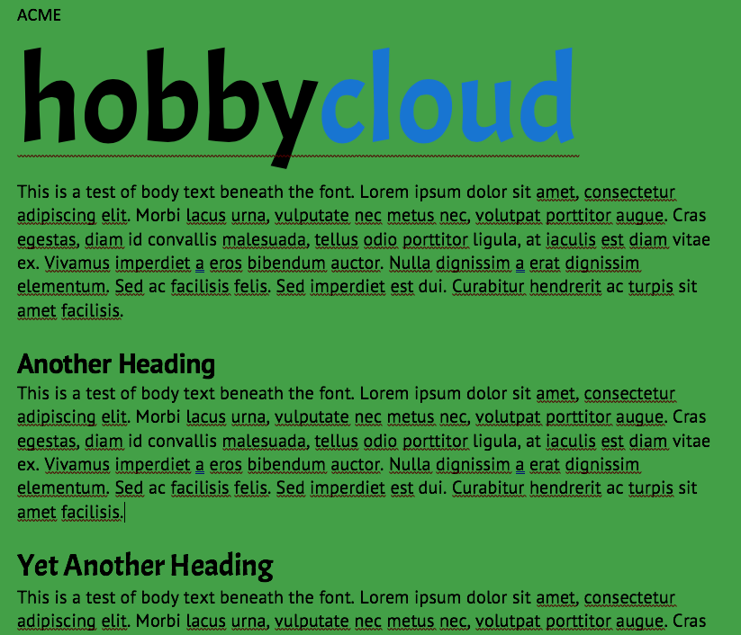
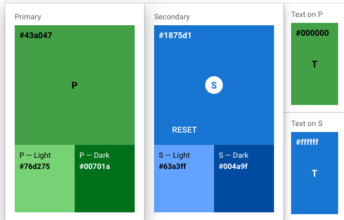

# HobbyCloud Design Notes
This living document serves as a source of reference material for website design and standards across the brand. The design guidelines for the brand are:

- Primary Colors
- Clean Lines
- Soft Shadows

# Fonts
- Title/Headings/Word mark: ACME (https://fonts.google.com/specimen/Acme)
- Body copy: PT Sans (https://fonts.google.com/specimen/PT+Sans)

# Colors
- Primary BG: #43a047
- Primary Light BG: #76d275
- Primary Dark BG: #00701a
- Secondary BG: #1875d1
- Secondary Light BG: #63a3ff
- Secondary Dark BG: #004a9f

# Logo
For now, a word mark will be used until a more final logo is designed. The word mark is lower-case "hobbycloud" with "cloud" being colored in the secondary background color (when on any BG except a secondary one) and "hobby" being in black/white (depending on background darkness).
